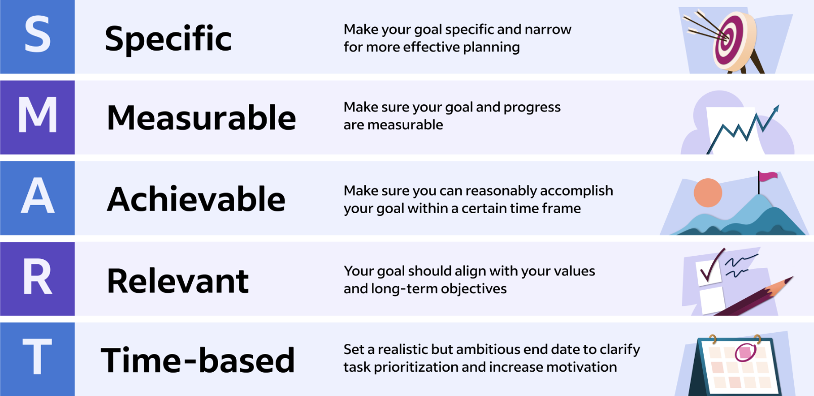
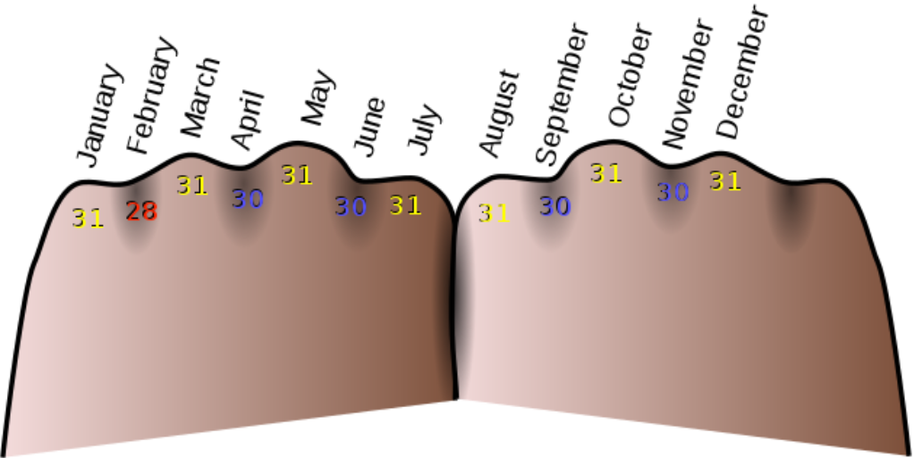
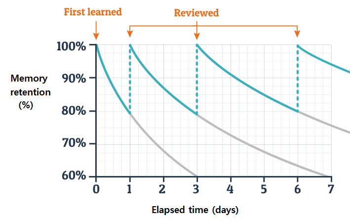
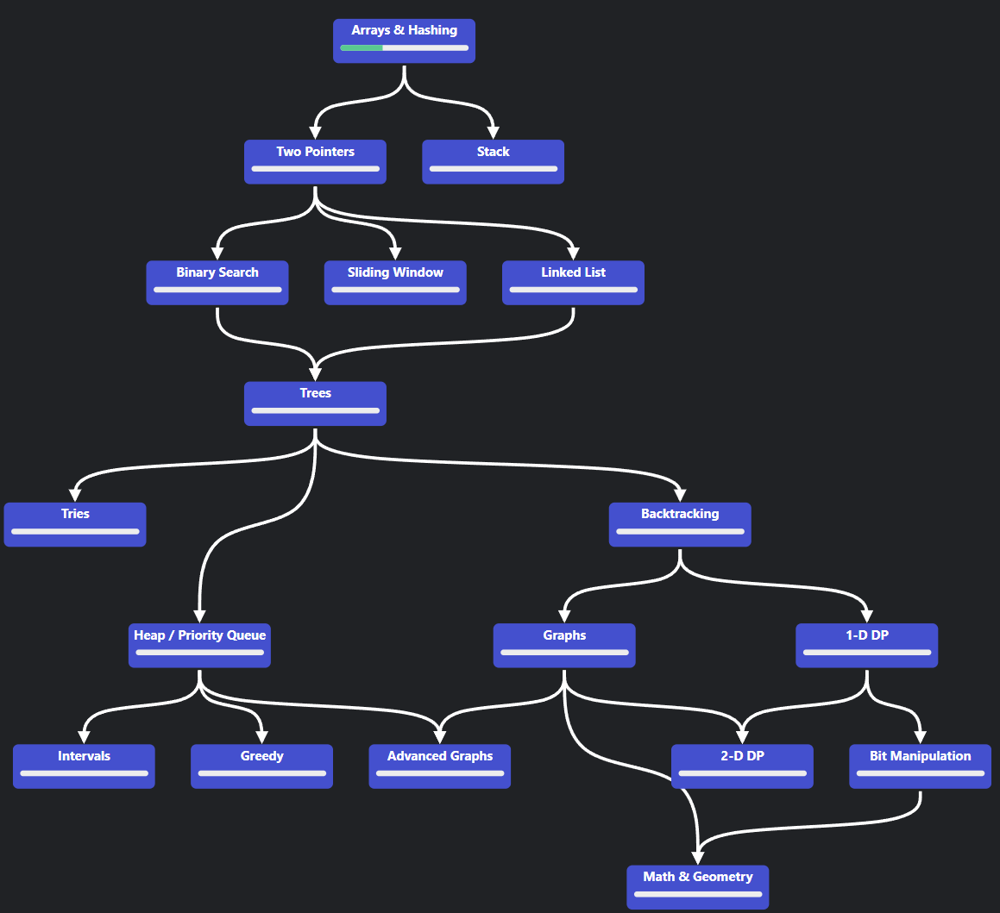

# Efficient Learning Guide

## Introduction
Welcome to a guide born from both struggles and discoveries in the quest for efficient learning. Through personal experiences and extensive exploration, I've compiled essential strategies and tools that have significantly enhanced my productivity and information retention. This guide distills those insights into actionable advice on mastering study habits, managing time, and utilizing technological aids to elevate your learning efficiency. Whether you're aiming to refine your learning process or adopt new, effective methods, you'll find valuable resources here to guide your journey toward becoming an efficient learner.

## Table of Contents
- [Reduce Distractions](#Reduce-Distractions)
- [Setting Learning Goals](#Setting-Learning-Goals)
- [Time Management for Learning](#Time-Management-for-Learning)
- [Speed Reading](#Speed-Reading)
- [Note-Taking Strategies](#Note-Taking-Strategies)
- [Learning Techniques](#Learning-Techniques)
- [Language Learning](#Language-Learning)
- [Programming](#Programming)
- [Mathematics](#Mathematics)

## Reduce Distractions
Despite being a common topic, minimizing distractions is crucial for efficient learning. Creating a conducive learning environment requires intentional effort, as distractions can significantly hinder your ability to absorb and retain information. While detailed strategies for maintaining focus are discussed in [Time Management for Learning](#Time-Management-for-Learning), here are immediate, actionable steps to limit distractions:
- **Manage Your Phone:**
	- Place it out of sight to avoid temptation. If that's not feasible, use silent or do not disturb modes.
	- Consider apps like Forest or Focus Plant to discourage frequent phone usage.
- **Organize Your Workspace:**
	- A clutter-free desk reduces mental clutter, fostering a more focused and productive learning environment.
- **Streamline Your Browser Use:**
	- Keep only essential tabs open to minimize digital distractions. If the browser is necessary, close all unrelated tabs before starting.

### A Clear Mind
Beyond physical distractions, our minds often wander to recent events, potential future pleasures, or unchecked tasks, drawing our focus away from learning. Mindfulness can be a powerful tool in recognizing and managing these mental distractions, allowing us to engage fully with the present moment.

Initially, I was skeptical about mindfulness, associating it with hippies and yoga moms. However, embracing mindfulness revealed its true value in enhancing mental clarity and focus. It's not just about being tranquil; it's about gaining control over your attention and directing it toward your learning goals.

Incorporating just 10 minutes of meditation into my daily routine has significantly improved my ability to stay present and focused. For those new to meditation, here are some guided sessions that I've found particularly helpful:

- [Daily Calm | 10 Minute Mindfulness Meditation | Impermanence](https://www.youtube.com/watch?v=uumInvT4t9Y)
- [Daily Calm | 10 Minute Mindfulness Meditation | Be Present](https://www.youtube.com/watch?v=ZToicYcHIOU)
- [5 Minute Long Deep Breaths](https://www.youtube.com/watch?v=Z8emmFOuhxE)

## Setting Learning Goals
Before embarking on a learning journey, it's crucial to define what you want to learn and establish clear goals. This could be mastering a new programming language, memorizing a set of facts, understanding the logic behind mathematical concepts, or any other subject matter. To give yourself a comprehensive overview of the knowledge or skills you aim to acquire, creating a list of well-defined goals can be beneficial. The SMART framework can help you formulate effective learning goals, ensuring they are:

### Example of Goals
When I was preparing for my Azure Fundamentals certification, I started by writing down my primary goal: "Pass the AZ-900 exam." However, to make this overarching goal more manageable and actionable, I divided it into smaller, more specific objectives.

The learning material for the AZ-900 exam was divided into three main parts, so I made mastering each of these parts a sub-goal. Furthermore, I broke down these parts into even smaller sections, as each part consisted of multiple topics or modules. By incorporating these granular sections into my goal list, I had a comprehensive overview of what I had already learned and what remained to be covered.

This approach not only provided me with a clear roadmap but also kept me motivated throughout the learning process. Whenever I completed a sub-goal, I experienced a sense of accomplishment, which fueled my determination to continue progressing.

To organize and track my goals effectively, I created a simple to-do list. Here's an example of what it looked like:
- [ ] Learning Paths Theory
	- [ ] Part 1: [Describe cloud concepts](https://learn.microsoft.com/en-us/training/paths/microsoft-azure-fundamentals-describe-cloud-concepts/)
		- [ ] [Describe cloud compute](https://learn.microsoft.com/en-us/training/modules/describe-cloud-compute/)
			- [ ] [What is cloud computing](https://learn.microsoft.com/en-us/training/modules/describe-cloud-compute/3-what-cloud-compute)
			- [ ] ...
			- [ ] ...
		- [ ] [Describe the benefits of using cloud services](https://learn.microsoft.com/en-us/training/modules/describe-benefits-use-cloud-services/)
	- [ ] Part 2: [Describe Azure architecture and services](https://learn.microsoft.com/en-us/training/paths/azure-fundamentals-describe-azure-architecture-services/)
	- [ ] Part 3: [Describe Azure management and governance](https://learn.microsoft.com/en-us/training/paths/describe-azure-management-governance/)

By breaking down my primary goal into smaller, achievable sub-goals and tracking my progress using a simple to-do list, I could maintain a clear overview of my learning journey. This approach not only kept me motivated but also helped me identify areas that required more attention or review.

The key takeaway is that setting and breaking down goals into manageable steps can significantly enhance your learning efficiency and overall success. It helps you stay organized, focused, and motivated throughout the learning process.

In [Note-Taking Strategies](#Note-Taking-Strategies) I cover what tools I use to keep track of my notes and my to-do lists.

## Time Management for Learning
Efficient time management is crucial for successful learning. One of the most widely recognized and scientifically proven techniques for boosting productivity and focus is the Pomodoro Technique. This simple yet powerful method can help you make the most of your study sessions and avoid procrastination or burnout.

The Pomodoro Technique is based on the idea of working in short, focused intervals, known as "Pomodoros," followed by brief breaks. Here's how it works:
1. **Set a timer for 25 minutes**: This is your Pomodoro, or focused work session. During this time, concentrate solely on the task at hand, whether it's reading, coding, or solving problems.
2. **Work until the timer rings**: Resist the urge to multitask or get distracted during the Pomodoro. Stay focused and immerse yourself in the learning material.
3. **Take a 5-minute break**: When the timer goes off, step away from your work and take a short break. Stretch, grab a snack, or do something relaxing to recharge your mental batteries.
4. **Repeat the cycle**: After the 5-minute break, start a new 25-minute Pomodoro. Repeat this cycle of focused work and short breaks throughout your study session.
5. **Take a longer break**: After completing four Pomodoros (approximately 2 hours of focused work), reward yourself with a longer break of 15-30 minutes.

There are numerous apps and browser extensions available to help you implement the Pomodoro Technique effectively. Some popular options include:
- [Pomofocus.io](https://pomofocus.io/): A simple, distraction-free online Pomodoro timer.
- [Focus To-Do: Pomodoro Timer & To Do List](https://chrome.google.com/webstore/detail/focus-to-do-pomodoro-time/ngceodoilcgpmkijopinlkmohnfifjfb): A Chrome extension that combines a Pomodoro timer with a to-do list for better task management.

By incorporating the Pomodoro Technique into your learning routine, you'll be able to maintain laser-sharp focus during your study sessions, while also allowing your mind to recharge during the scheduled breaks. This balance of intense focus and strategic rest can significantly enhance your productivity, retention, and overall learning efficiency.

## Speed Reading
As the name suggests speed reading is a technique to improve your ability to read quickly. Many techniques can be applied to improve your reading performance. I will cover the ones I think are especially helpful. Consider that applying these techniques will take time and practice. If you want to keep track of your performance, you can start by measuring your words per minute (WPM). Reading quicker can also have an impact on your retention, so be sure to test that as well as you want to find a balance between remembering what you have read and how quickly you have read it.

### Peripheral Vision
Try using your peripheral vision to read this text. Start by focusing on one word in this sentence and see how much you can read without moving your eyes. This technique is useful, as it does not have a big impact on your retention, reduces eye strain, and improves reading speed. If you would like to learn more about this, I suggest [this free Medium article](https://medium.com/@emadoat/using-peripheral-vision-to-read-more-words-at-once-348439016ab6).

### Use a Pointer
The pointer method is a way to start learning how to speed read that involves physically following along with words as you read them. Place a notecard underneath each line as you read it, or move your finger along the page. The pointer method helps to reduce eye strain and maintain a constant reading speed. This method is also known as meta guiding or hand pacing.

Often these methods only use examples that apply to physical paper however, oftentimes these can also be used while reading from a computer screen. There are two ways to use the pointer method on a PC. The first is by keeping track of what you're reading by using your cursor, this can be either by highlighting the parts you're reading or simply moving the cursor along the words you're reading.
Another method is by only having that text that you have to read on the page. That way you cover the words you've already read, this helps when you need to move to the next sentence and also keeps you focused on the text that you are currently reading.

### Reduce Subvocalization
Many people subvocalize or sound out every word they read in their heads. This may help your reading comprehension but it also slows you down a lot. This makes sense as your theoretically fastest talking speed is always slower than your theoretically fastest reading speed. This is hard to practice, as it often feels natural to do this when reading, especially if you have been doing this for a long time. There are few methods to reduce subvocalizations such as:
- Chew gum or hum while you read
- Tap your foot or hand
- Point to the words you’re reading on the page

## Note-Taking Strategies
Taking comprehensive and well-organized notes is a crucial aspect of effective learning. One powerful tool that can streamline your note-taking process is [Obsidian.md](https://obsidian.md/), a free and open-source writing app designed specifically for knowledge management and note-taking.

Obsidian.md offers several advantages over traditional note-taking methods:
1. **Local Storage and Privacy**: Unlike cloud-based note-taking apps, Obsidian.md stores your notes locally on your computer, ensuring complete privacy and control over your data.
2. **Cross-Platform Availability**: By combining Obsidian.md with a cloud storage service like OneDrive, you can access and sync your notes across multiple devices, ensuring seamless access to your knowledge base from anywhere.
3. **Intuitive Linking and Visualization**: One of Obsidian.md's standout features is its ability to automatically create a visual map of your notes as you link them together. This feature, known as the "Graph View," provides a beautiful and intuitive overview of your notes and the connections between them, making it easier to navigate and explore your knowledge base.
4. **Customizability and Plugin Ecosystem**: With a large and active user community, Obsidian.md offers a vast array of plugins and customization options, allowing you to tailor the app to your specific note-taking preferences and workflows.

While Obsidian.md may seem daunting at first, its user-friendly interface and extensive documentation make it relatively easy to get started. To help you kickstart your journey with Obsidian.md, I recommend watching [this YouTube video](https://www.youtube.com/watch?v=3ccktMJ1YHI), which provides an excellent introduction to the app and highlights some useful plugins.

### Tips for Effective Note-Taking
While using a powerful note-taking app like Obsidian.md can greatly enhance your learning experience, it's equally important to develop effective note-taking habits and strategies. Here are some tips to help you make the most of your note-taking sessions:

1. **Be Selective**: Avoid the temptation to transcribe every word verbatim. Instead, focus on capturing key points, concepts, and details that are likely to be important or challenging to remember. This selective approach will help you stay engaged and prevent your notes from becoming cluttered with unnecessary information.
2. **Use Your Own Words**: Rather than simply copying information word-for-word, strive to summarize and rephrase concepts in your own language. This practice not only aids in comprehension and retention but also encourages you to actively process and internalize the material.
3. **Review and Revise**: Shortly after a lecture, reading, or study session, take the time to review and revise your notes. Fill in any gaps, clarify any confusing points, and organize your thoughts. If you're using digital notes in Obsidian.md, consider adding visual aids, such as diagrams or screenshots, to help illustrate complex concepts or processes.
4. **Engage with Your Notes**: Actively engaging with your notes can significantly enhance your understanding and retention. Consider summarizing key points, teaching the content to someone else, or creating flashcards or quizzes for important concepts. In Obsidian.md, you can use features like highlighting, tags, or callouts to emphasize and organize critical information.
5. **Develop a Personal Note-Taking System**: Experiment with different note-taking techniques and find a system that works best for you. Some effective methods include the Cornell note-taking system, mind mapping, or the outline method. Consistency in your approach will make it easier to review and navigate your notes later.

## Learning Techniques
Now that you have written your notes, we can explore different techniques to help you learn effectively. There are two main approaches: active and passive learning.

**Active Learning:** In this approach, you actively engage with the material, promoting better understanding and retention. Some effective active learning strategies include:
- Creating practice tests or flashcards to review and reinforce concepts.
- Explaining concepts to peers or even to yourself (out loud or in writing) to solidify your understanding.
- Interacting with AI chatbots like ChatGPT to clarify doubts and gain deeper insights.
- Engaging in exercises or projects that require applying concepts to solve problems or create something new.

**Passive Learning:** Passive learning involves absorbing information through listening or reading without direct interaction with the material. Examples include attending lectures or reading textbooks. While passive learning is a common approach, it often leads to lower retention rates compared to active learning techniques.

Personally, I find that the effectiveness of these strategies varies depending on the topic and learning style. Not all active learning techniques suit every subject. For instance, I prefer using flashcards when learning a new language (more on that in the next section), but when learning to program, I find hands-on practice to be the most effective approach. When studying for exams, I tend to read my notes thoroughly and ensure I understand everything I have written down, which can be considered a passive learning technique.

The key is to experiment with different strategies and find the ones that work best for you and the specific subject matter. Combining active and passive learning techniques can often yield the best results, ensuring a well-rounded and effective learning experience.

## Memory Enhancement Techniques
Sometimes you encounter terms or names that you have to remember, but for some reason they just don't stick. Fortunately, there are multiple memory techniques to help you remember difficult words or facts.

### Mnemonics
Mnemonics are memory aids that help in recalling complex information through associations. An example that most people know is using your knuckles the remember the number of days for each month.

I've found mnemonics particularly effective in language learning. By linking a new word to a familiar concept or phrase, it becomes significantly easier to recall. For instance, to remember the Indonesian word for mouse, _tikus_, I think of "tickle us." Imagine a mouse scampering up your sleeve, tickling as it goes. Personalizing your mnemonics and adding an emotional or sensory layer makes the memory stick even better.

### Spaced Repetition
Spaced repetition leverages the power of timing to cement information in long-term memory, utilizing increasing intervals between review sessions to boost retention. This technique is backed by extensive research demonstrating its effectiveness in learning. By reviewing material at strategically spaced intervals, you effectively flatten the curve of forgetting, ensuring that information remains accessible over longer periods.

### Flashcards
For practical application, flashcards are a staple tool in employing spaced repetition. Whether you prefer physical cards or digital ones, the principle remains the same: review and repetition are key to transferring knowledge from short-term to long-term memory. [Anki](https://apps.ankiweb.net/) / [AnkiWeb](https://ankiweb.net/), a versatile and free platform for creating digital flashcards, is my go-to for language learning. Its flexibility and effectiveness are not limited to languages, though; it's equally useful for subjects requiring heavy memorization, such as medical and law exams.

### Mind Palace
The Mind Palace, or the method of loci, is a powerful memory technique used by champions in memorization. It's effective because it taps into our strong spatial and visual memory skills. Imagine creating a virtual space in your mind where you can store and retrieve information easily. Here's a simple way to use it:

1. **Pick a Familiar Place:** This could be your home, a favorite park, or your school.
2. **Visualize Items in This Place:** Place the items you need to remember throughout this location. The more unusual or funny you make these items, the better you'll remember them.
3. **Engage Your Senses:** Try to use as many senses as you can when you imagine these items.
4. **Create a Path:** Make a route through your chosen place and follow it in your mind to place and recall items.
5. **Practice:** The more you use this route, the stronger your memory of the items will become.

Dealing with abstract things like numbers can be tricky. Dominic O'Brien, in his book _You Can Have an Amazing Memory_, suggests populating your Mind Palace with familiar people to help. To remember numbers, you could assign each number a letter (for example, A=1, S=5 since S looks like a 5) and then think of a person with those initials. For example, for a sequence of 15, think of Arnold Schwarzenegger and imagine placing him somewhere in your Mind Palace. To remember even more information, you can associate each person with specific objects.

Though I've found the Mind Palace less useful for everyday tasks, it's incredibly effective for memorizing complex sequences, like a deck of cards. If you're up for a memory challenge, give this technique a try!

## Language Learning
This section delves into strategies and tools I've found effective for language learning, drawing on personal research and insights from Gabriel Wyner's *Fluent Forever*. 
1. Begin by learning the [625 most useful words](https://fluent-forever.com/wp-content/uploads/2014/05/625-List-Thematic.pdf). Use DeepL and Google Translate for translations to your target language. 
2. Search for related images using the translated words, ideally in the target language, to ensure accuracy and cultural relevance.
3. Combine the image and its translation in Anki to create flashcards.
4. Develop [mnemonics](#Mnemonics) to associate with each word, either during flashcard creation or review sessions.
I'm also working on a project to generate mnemonic images automatically, enhancing efficiency. Follow the progress at [FluentAI](https://github.com/StephanAkkerman/FluentAI).

### Small Habits
Learning a new language can seem daunting, especially with the prospect of dedicating hours daily. To mitigate this, incorporate short, daily language learning sessions into your routine. For example, dedicating 10-30 minutes to vocabulary review after breakfast can significantly boost language comprehension over time without feeling burdensome. Establishing this as a daily habit makes language learning a seamless part of your day.

#### Habit Stacking
To further embed your language learning habit, try habit stacking. This technique involves integrating new habits into existing routines, enhancing enjoyment and consistency. For instance, coupling language study with your morning coffee ritual can transform it into a daily practice that feels natural and rewarding.

Personally, I align my language study sessions with meal times—after breakfast, lunch, and dinner—to capitalize on the energy boost they provide. For accelerated learning, consider multiple short sessions throughout the day, using each meal as a trigger for language practice.

### Shadowing
Shadowing is a popular language learning technique based on listening to a clip with desirable pronunciation or accent and repeating word for word aloud with as little delay as possible. Basically, the learner has to become a shadow of the speaker they choose. This is especially useful if you want to sound like a native speaker, as you can practice your accent with this method.

To practice shadowing you simply look for a video or audio clip with the preferred accent, for instance on YouTube or podcasts. Next, you can either listen to the clip first and then start shadowing or immediately start shadowing. If it's the first time you listen to this clip it is recommended to first listen and after listening to the part you want to shadow you go back and start the process of shadowing.

## Programming
Learning programming effectively combines grasping basic syntax with hands-on practice. Initially, find a comprehensive guide that includes practical exercises. For video tutorials, I recommend watching entirely first to grasp the instructor's logic and reasoning behind each code snippet. Understanding the "why" before pausing or replicating enhances memory and application skills. After the video, challenge yourself to write the code independently, referencing the tutorial as minimally as possible.

### Hobby Projects
For those more versed in programming, embarking on hobby projects related to personal interests can significantly boost skills. My projects often merge AI innovations with investment strategies, shared on GitHub. This not only motivates through potential community engagement, such as follows or stars, but also encourages writing clear, understandable code.

#### ChatGPT
While ChatGPT's coding skills can automate many tasks, its true value for learners lies in code review. Asking ChatGPT for code improvements educates on best practices and introduces higher-quality coding habits. Ensure you fully understand any suggested changes before integrating them into your project.

### Neetcode
[Neetcode.io](https://neetcode.io/) offers a structured approach to enhance coding abilities, making it an excellent alternative to the more chaotic leetcode. With its clear roadmap and the same cost-free access, Neetcode helps pinpoint your skill development areas, streamlining your learning process.

## Mathematics
Understanding and applying knowledge is crucial, not just in mathematics but in all subjects where application outweighs rote memorization. My experience tutoring high school students in math revealed a common pattern: a rush to solve problems without grasping the underlying concepts. Comprehending the logic before application simplifies memorization and execution of operations.

1. **Engage with the Theory**: Begin with the foundational theory, whether it's the rationale behind an operation or the purpose of a procedure. Keep it broad enough to grasp the logic without getting bogged down in details.
2. **Examine Examples**: Review how concepts are applied through examples, paying attention to how operations are executed and noting any special cases. Ensure you understand these instances well enough to mimic them independently.
3. **Document the Process**: Mathematics often involves a series of steps leading to a solution. Detail these steps clearly, creating a step-by-step guide that serves as a blueprint for tackling similar problems. Remember, the sequence of operations in math is usually fixed and critical to arriving at the correct solution.
4. **Practice on New Problems**: Armed with your guide, apply these steps to fresh problems to refine your skills and deepen your understanding.

This approach fosters a deeper connection with mathematical concepts, transforming them from abstract ideas to tools you can wield confidently and correctly.
